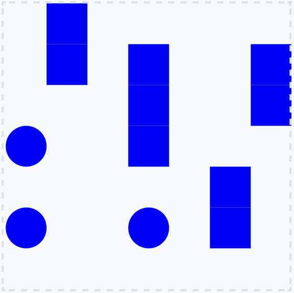

# Battleships

This folder contains a solution to the solitaire version of the [Battleships](https://puzzlemadness.co.uk/battleships/) puzzle.

The output is a Scalar Vector Graphics (SVG) document that can be pasted into a SVG viewer, such as [https://www.svgviewer.dev](https://www.svgviewer.dev).

For data file [battleships_7_7](battleships_7_7.dzn) the output is:
```
<svg width="70" height="70">
<rect x=10 y=0 width=10 height=10 fill="blue" />
<rect x=10 y=10 width=10 height=10 fill="blue" />
<rect x=30 y=10 width=10 height=10 fill="blue" />
<rect x=60 y=10 width=10 height=10 fill="blue" />
<rect x=30 y=20 width=10 height=10 fill="blue" />
<rect x=60 y=20 width=10 height=10 fill="blue" />
<circle cx="5" cy="35" r="5" fill="blue" />
<rect x=30 y=30 width=10 height=10 fill="blue" />
<rect x=50 y=40 width=10 height=10 fill="blue" />
<circle cx="5" cy="55" r="5" fill="blue" />
<circle cx="35" cy="55" r="5" fill="blue" />
<rect x=50 y=50 width=10 height=10 fill="blue" />
</svg>
```
which displays as:

