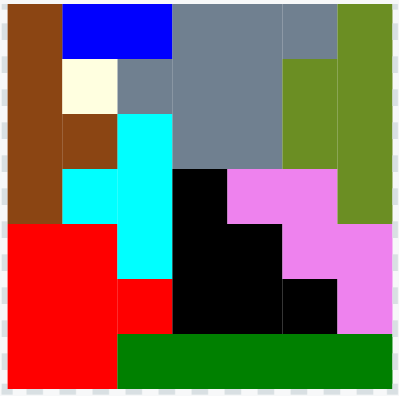

# Castle Puzzle

Solution to a wooden puzzle I picked up at a merket. which is at heart a tile fitting puzzle. The pieces cover the base with one spare cell, which is nominated as forbidden.

The output is a Scalar Vector Graphics (SVG) document that can be pasted into a SVG viewer, such as [https://www.svgviewer.dev](https://www.svgviewer.dev).

The output produced is:
```
<svg width="70" height="70"><g transform="scale(10)">
<rect style="fill:red" width="2" height="3" x="0" y="4"/><rect style="fill:red" width="1" height="1" x="2" y="5"/>
<rect style="fill:green" width="5" height="1" x="2" y="6"/>
<rect style="fill:blue" width="2" height="1" x="1" y="0"/>
<rect style="fill:aqua" width="1" height="3" x="2" y="2"/><rect style="fill:aqua" width="1" height="1" x="1" y="3"/>
<rect style="fill:black" width="2" height="2" x="3" y="4"/><rect style="fill:black" width="1" height="1" x="3" y="3"/><rect style="fill:black" width="1" height="1" x="5" y="5"/>
<rect style="fill:violet" width="2" height="1" x="4" y="3"/><rect style="fill:violet" width="2" height="1" x="5" y="4"/><rect style="fill:violet" width="1" height="1" x="6" y="5"/>
<rect style="fill:slategrey" width="1" height="1" x="2" y="1"/><rect style="fill:slategrey" width="2" height="3" x="3" y="0"/><rect style="fill:slategrey" width="1" height="1" x="5" y="0"/>
<rect style="fill:saddlebrown" width="1" height="4" x="0" y="0"/><rect style="fill:saddlebrown" width="1" height="1" x="1" y="2"/>
<rect style="fill:olivedrab" width="1" height="4" x="6" y="0"/><rect style="fill:olivedrab" width="1" height="2" x="5" y="1"/>
<rect style="fill:lightyellow" width="1" height="1" x="1" y="1"/>
</g></svg>
```
which displays as



Note: the origin of the model co-ordinates is bottom-left. The origin of SVG co-ordinates is top-left. The displayed solution is reflection of the actual solution on the horizontal axis.