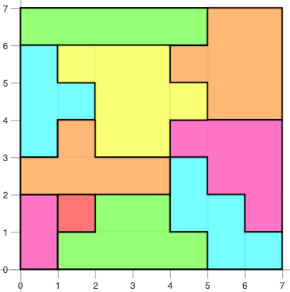

# Castle Puzzle

Solution to a wooden puzzle I picked up at a market. which is at heart a tile fitting puzzle. The pieces cover the base with one spare cell, which is nominated as forbidden.

Output is via MiniZinc visualisation (the _vis_geost_2d_ annotation), and displays as:

