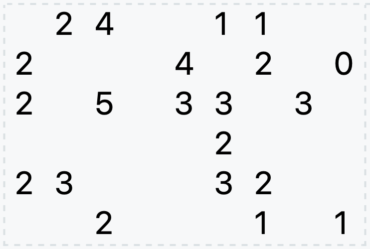
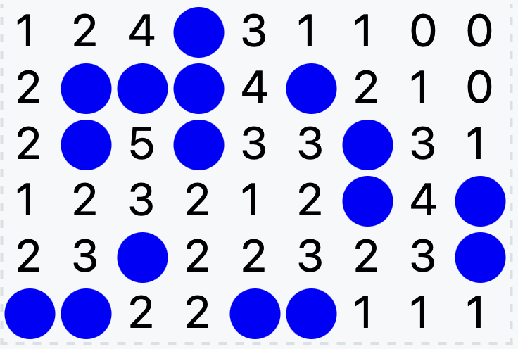

# Minesweeper

This folder contains a solution to the [Minesweeper](https://puzzlemadness.co.uk/minesweeper/) puzzle.

The output consists of:
- solution in ASCII text;
- initial configuration in Scalar Vector Graphics (SVG);
- solution in SVG.

For data file [minesweeper_6_9](minesweeper_6_9.dzn) the ASCII output is:
```
124*31100
2***4*210
2*5*33*31
123212*4*
23*22323*
**22**111
```
The initial configuration displays as:



The solution displays as:

