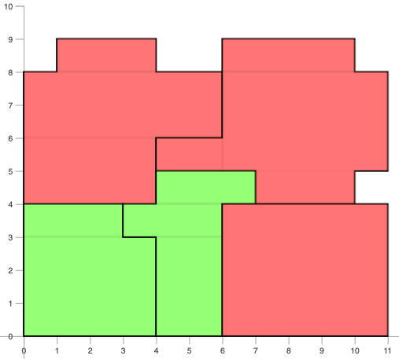

# Packing

The [castle-puzzle](../castle-puzzle) model is a simple application of packing using _geost_. The most difficult part of the solution was creating the rather complicated input files. 

This folder contains a utility that simplifies the process of creating the input data for packing with _geost_. There are two MiniZinc models and two Python scripts.

- [rectilinear.mzn](rectilinear.mzn) takes a rectilinear shape modelled by a 2D array of 0/1 values, and calculates a minimal set of rectangles that represent the shape.

- [pack.mzn](pack.mzn) take a set of parameters in the form expected by _geost_, packs the shapes, and presents the solution using MiniZinc visualisation.

- [packing.py](packing.py) ties it together:

  - read a set of shapes described in an ASCII file
  - apply [rectilinear.mzn](rectilinear.mzn) to each shape in the input file
  - from the set of rectilinear shapes, calculate the input data required for a call to _geost_
  - apply [pack.mzn](pack.mzn) to pack the shapes and generate the output

- [rectoff.py](rectoff.py) contains support classes for [packing.py](packing.py).

An example of an input file is [packing1.txt](data/packing1.txt). The first line is the extent (X direction followed by Y direction) of the bounds into which the shapes must be packed. In the remainder, `*` indicates a cell that is part of the shape, `.` is not part of the shape. All lines for a shape must be of the same length. Shapes are separated by one or more blank lines.

The utility is run with the command:
```
python3 packing.py <shapes-file>
```
Example output for [packing1.txt](data/packing1.txt):
```
----
x_extent=11;
y_extent=9;
rect_offset=[|0,0|0,2|1,4|0,2|2,0|4,2|0,1|2,0|2,3|0,1|1,0|3,0|0,0|0,3|0,0|3,1|0,1|1,0|0,0|1,0|0,1|2,1|2,4|3,0|1,0|1,5|4,1|0,1|1,0|5,3|0,2|1,2|3,0|4,3|1,0|0,1|4,0|0,0|1,1|1,2|1,0|2,1|0,0|0,0|];
rect_size=[|4,2|6,2|3,1|2,4|2,6|1,3|6,2|3,1|4,2|1,3|2,6|2,4|4,3|3,1|3,4|1,3|4,3|3,1|1,3|3,4|2,1|5,3|4,1|3,1|3,5|1,2|1,4|5,3|4,1|2,1|1,4|3,5|1,2|1,3|2,3|3,2|1,3|3,1|3,1|2,3|1,3|3,2|5,4|4,5|];
shape=[{1, 2, 3}, {4, 5, 6}, {8, 9, 7}, {10, 11, 12}, {13, 14}, {16, 15}, {17, 18}, {19, 20}, {24, 21, 22, 23}, {27, 25, 10, 26}, {3, 28, 29, 30}, {32, 33, 34, 31}, {3, 35, 14}, {16, 36, 37}, {40, 38, 39}, {41, 10, 42}, {43}, {44}];
shape_index=[{1, 2, 3, 4}, {8, 5, 6, 7}, {9, 10, 11, 12}, {16, 13, 14, 15}, {17, 18}];
----
coord=[[0, 4], [0, 0], [4, 4], [3, 0], [6, 0]];
kind=[1, 5, 9, 13, 17];
```
The lines demilited by `---` can be used as input to [pack.mzn](pack.mzn).

When [pack.mzn](pack.mzn) is run within the MiniZinc IDE, visualisation is employed to present the output. For the above data:



By default all rotations of a shape are included. The `-u` parameter only considers the orientation of a shape as presented in the input file.