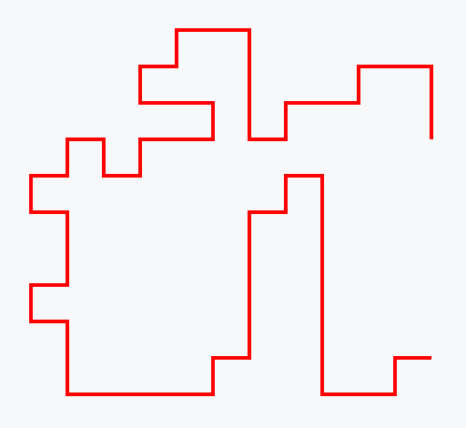

# Train Tracks Puzzle

This folder contains a solution to the common [train tracks puzzle](https://puzzlemadness.co.uk/traintracks/medium).

Track pieces are placed on a grid to form a continuous path from the entry point to the exit point. Each track piece is vertical, horizontal, or one of the four rotations of a corner piece. Constraints:

- some initial track pieces are fixed;
- the number of pieces that can appear in each row and column of the grid is fixed.

The output is a Scalar Vector Graphics (SVG) documet that can be pasted into a SVG viewer, such as [https://www.svgviewer.dev](https://www.svgviewer.dev).

For data file [train-tracks-11-12](train-tracks-11-12.dzn) the output is:
```
<svg width="130" height="120">
<polyline style="fill:none;stroke:red" points="120,100 110,100 110,110 100,110 90,110 90,100 90,90 90,80 90,70 90,60 90,50 80,50 80,60 70,60 70,70 70,80 70,90 70,100 60,100 60,110 50,110 40,110 30,110 20,110 20,100 20,90 10,90 10,80 20,80 20,70 20,60 10,60 10,50 20,50 20,40 30,40 30,50 40,50 40,40 50,40 60,40 60,30 50,30 40,30 40,20 50,20 50,10 60,10 70,10 70,20 70,30 70,40 80,40 80,30 90,30 100,30 100,20 110,20 120,20 120,30 120,40 "/></svg>
```
which displays as:

