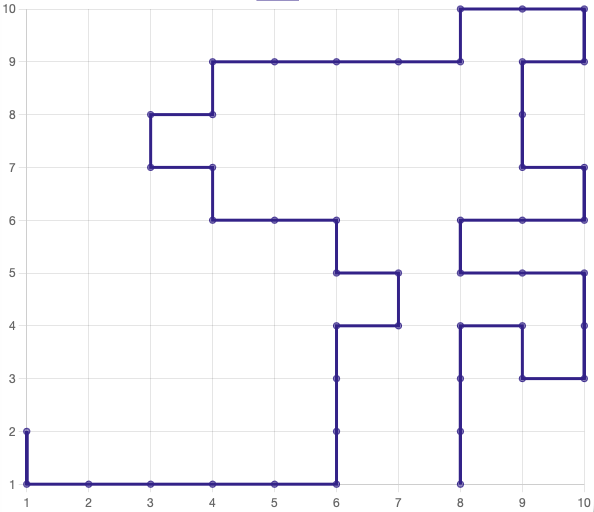

# Train Tracks Puzzle

This folder contains a solution to the popular [train tracks](https://puzzlemadness.co.uk/traintracks/medium) puzzle.

Track pieces are placed on a grid to form a continuous path from the entry point to the exit point. Each track piece is vertical, horizontal, or one of the four rotations of a corner piece. Constraints:

- some initial track pieces are fixed;
- the number of pieces that can appear in each row and column of the grid is fixed.

Output is via MiniZinc visualisation (the _vis_line_ annotation). For data file [train-tracks-10-10](train-tracks-10-10.dzn) the output is:

